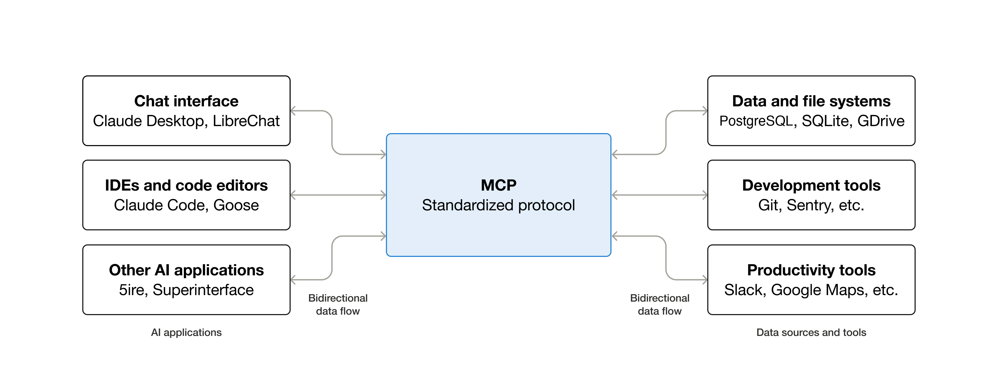

<!-- 原文来源 Source: https://modelcontextprotocol.io/docs/2026-07-28/getting-started/intro.md -->
<!-- 译文对应原文文件：1 What is MCP.md -->

> ## 文档索引（Documentation Index）
> 在此获取完整的文档索引：https://modelcontextprotocol.io/llms.txt
> 在进一步探索之前，可用该文件发现所有可用页面。

# 什么是模型上下文协议（Model Context Protocol，MCP）？

MCP（Model Context Protocol，模型上下文协议）是一个用于将 AI 应用连接到外部系统的开源标准。

借助 MCP，像 Claude 或 ChatGPT 这样的 AI 应用可以连接到数据源（如本地文件、数据库）、工具（如搜索引擎、计算器）以及工作流（如专用提示词），从而使它们能够访问关键信息并执行任务。

可以把 MCP 想象成 AI 应用的 USB-C 接口。正如 USB-C 提供了一种连接电子设备的标准化方式，MCP 提供了一种将 AI 应用连接到外部系统的标准化方式。

## 1 MCP 能实现什么？（What can MCP enable?）

* 智能体（Agents）可以访问你的 Google Calendar 和 Notion，充当更个性化的 AI 助手。
* Claude Code 可以根据一份 Figma 设计稿生成一个完整的 Web 应用。
* 企业聊天机器人可以连接到组织内的多个数据库，让用户能够通过聊天来分析数据。
* AI 模型可以在 Blender 上创建 3D 设计，并用 3D 打印机将其打印出来。

## 2 为什么 MCP 很重要？（Why does MCP matter?）

取决于你在生态系统中所处的位置，MCP 可以带来一系列好处。

* **开发者（Developers）**：在构建 AI 应用或智能体、或与其集成时，MCP 降低了开发时间和复杂度。
* **AI 应用或智能体（AI applications or agents）**：MCP 提供了对数据源、工具与应用生态的访问能力，从而增强能力并改善最终用户体验。
* **最终用户（End-users）**：MCP 带来更强大的 AI 应用或智能体，它们能够访问你的数据，并在必要时代表你采取行动。

## 3 广泛的生态支持（Broad ecosystem support）

MCP 是一个开放协议，被众多客户端（clients）与服务器（servers）所支持。像 [Claude](https://claude.com/docs/connectors/building) 和 [ChatGPT](https://developers.openai.com/api/docs/mcp/) 这样的 AI 助手，以及 [Visual Studio Code](https://code.visualstudio.com/docs/copilot/chat/mcp-servers)、[Cursor](https://cursor.com/docs/context/mcp)、[MCPJam](https://docs.mcpjam.com/getting-started) 等开发工具都支持 MCP——让你可以「一次构建，处处集成」。

## 4 开始构建（Start Building）

<CardGroup cols={2}>
  <Card title="构建服务器" icon="server" href="/docs/2026-07-28/develop/build-server">
    创建 MCP 服务器，以对外暴露你的数据和工具
  </Card>

  <Card title="构建客户端" icon="computer" href="/docs/2026-07-28/develop/build-client">
    开发能够连接到 MCP 服务器的应用
  </Card>

  <Card title="构建 MCP 应用" icon="puzzle-piece" href="/extensions/apps/overview">
    构建可在 AI 客户端内部运行的交互式应用
  </Card>
</CardGroup>

## 5 了解更多（Learn more）

<CardGroup cols={2}>
  <Card title="理解核心概念" icon="book" href="/docs/2026-07-28/learn/architecture">
    学习 MCP 的核心概念与架构
  </Card>
</CardGroup>
