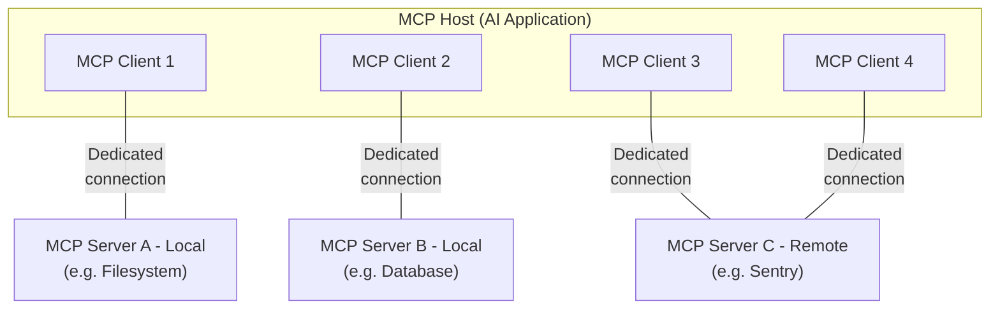

<!-- 原文来源 Source: https://modelcontextprotocol.io/docs/2026-07-28/learn/architecture -->
<!-- 译文对应原文文件：1 Architecture.md -->

> ## 文档索引（Documentation Index）
> 在此获取完整的文档索引：https://modelcontextprotocol.io/llms.txt
> 在进一步探索之前，可用该文件发现所有可用页面。

# 架构总览（Architecture overview）

本文概述模型上下文协议（Model Context Protocol，MCP），讨论其[适用范围](#scope)与[核心概念](#concepts-of-mcp)，并提供一个[示例](#example)来演示每个核心概念。

由于 MCP SDK 已经封装了许多细节，大多数开发者可能会觉得[数据层协议（data layer protocol）](#data-layer-protocol)这一节最为实用。它讨论了 MCP 服务器如何向 AI 应用提供上下文（context）。

关于具体的实现细节，请参阅你所使用编程语言对应的 [SDK 文档](/docs/2026-07-28/sdk)。

## 1 适用范围（Scope）

模型上下文协议包含以下几个项目：

* [MCP 规范（MCP Specification）](https://modelcontextprotocol.io/specification/latest)：MCP 的规范文档，规定了客户端（clients）与服务器（servers）的实现要求。
* [MCP SDK](/docs/2026-07-28/sdk)：面向不同编程语言、实现 MCP 的 SDK。
* **MCP 开发工具**：用于开发 MCP 服务器与客户端的工具，包括 [MCP Inspector](https://github.com/modelcontextprotocol/inspector)
* [MCP 参考服务器实现（MCP Reference Server Implementations）](https://github.com/modelcontextprotocol/servers)：MCP 服务器的参考实现。

<Note>
  MCP 只专注于上下文交换的协议本身——它并不规定 AI 应用应如何使用大语言模型（LLM）或如何管理所提供的上下文。
</Note>

## 2 MCP 的核心概念（Concepts of MCP）

### 2.1 参与方（Participants）

MCP 遵循客户端-服务器（client-server）架构：MCP 宿主（MCP host）——例如 [Claude Code](https://www.anthropic.com/claude-code) 或 [Claude Desktop](https://www.claude.ai/download) 这样的 AI 应用——会与一个或多个 MCP 服务器建立连接。MCP 宿主的做法是为每个 MCP 服务器创建一个 MCP 客户端（MCP client）。每个 MCP 客户端都与其对应的 MCP 服务器维持一条专用连接。

使用 STDIO 传输方式的本地 MCP 服务器通常只服务单个 MCP 客户端，而使用 Streamable HTTP 传输方式的远程 MCP 服务器则通常会服务多个 MCP 客户端。

MCP 架构中的关键参与方包括：

* **MCP 宿主（MCP Host）**：协调并管理一个或多个 MCP 客户端的 AI 应用
* **MCP 客户端（MCP Client）**：维持与某个 MCP 服务器的连接、并从该服务器获取上下文供 MCP 宿主使用的组件
* **MCP 服务器（MCP Server）**：向 MCP 客户端提供上下文的程序

**举例来说**：Visual Studio Code 扮演 MCP 宿主的角色。当 Visual Studio Code 与某个 MCP 服务器（例如 [Sentry MCP 服务器](https://docs.sentry.io/product/sentry-mcp/)）建立连接时，Visual Studio Code 的运行时会实例化一个 MCP 客户端对象，用以维持与该 Sentry MCP 服务器的连接。
当 Visual Studio Code 随后又连接到另一个 MCP 服务器（例如[本地文件系统服务器](https://github.com/modelcontextprotocol/servers/tree/main/src/filesystem)）时，Visual Studio Code 的运行时会再实例化一个额外的 MCP 客户端对象，用以维持这条新连接。



需要注意的是，**MCP 服务器**指的是提供上下文数据的程序，与其运行在何处无关。MCP 服务器既可以在本地运行，也可以在远程运行。举例来说，当 Claude Desktop 启动[文件系统服务器](https://github.com/modelcontextprotocol/servers/tree/main/src/filesystem)时，该服务器与 Claude Desktop 运行在同一台机器上，因为它使用的是 STDIO 传输方式。这通常被称为「本地」MCP 服务器。而官方的 [Sentry MCP 服务器](https://docs.sentry.io/product/sentry-mcp/)运行在 Sentry 平台上，使用 Streamable HTTP 传输方式，这通常被称为「远程」MCP 服务器。

### 2.2 分层（Layers）

MCP 由两层组成：

* **数据层（Data layer）**：定义基于 JSON-RPC 的客户端-服务器通信协议，包括能力（capability）与版本发现，以及诸如工具（tools）、资源（resources）、提示词（prompts）与通知（notifications）等核心原语（primitives）。
* **传输层（Transport layer）**：定义使客户端与服务器之间能够进行数据交换的通信机制与通道，包括特定传输方式下的连接建立、消息分帧（message framing）与鉴权（authorization）。

从概念上讲，数据层是内层，传输层是外层。

#### 2.2.1 数据层（Data layer）

数据层实现了一套基于 [JSON-RPC 2.0](https://www.jsonrpc.org/) 的交换协议，定义了消息的结构与语义。
该层包括：

* **发现（Discovery）**：让客户端能够通过 `server/discover` 请求，查询服务器所支持的协议版本、能力（capabilities）与身份信息
* **服务器特性（Server features）**：使服务器能够提供核心功能，包括供 AI 执行动作的工具（tools）、提供上下文数据的资源（resources），以及在客户端与服务器之间往来的、用于交互模板的提示词（prompts）
* **客户端特性（Client features）**：使服务器能够向用户征询（elicit）输入。采样（Sampling）功能自协议版本 `2026-07-28` 起已[弃用](/specification/2026-07-28/deprecated)。
* **实用特性（Utility features）**：支持额外的能力，例如用于实时更新的通知（notifications），以及用于跟踪长时间运行操作进度的功能

#### 2.2.2 传输层（Transport layer）

传输层负责管理客户端与服务器之间的通信通道与身份验证。它处理连接建立、消息分帧，以及 MCP 各参与方之间的安全通信。

MCP 支持两种传输机制：

* **Stdio 传输**：使用标准输入/输出流，在同一台机器上的本地进程之间进行直接通信，性能最优，没有网络开销。
* **Streamable HTTP 传输**：使用 HTTP POST 发送客户端到服务器的消息，并可选地配合 Server-Sent Events 实现流式能力。这种传输方式支持远程服务器通信，并支持标准的 HTTP 身份验证方法，包括 bearer token、API key 以及自定义请求头。MCP 建议使用 OAuth 来获取身份验证令牌。

传输层将通信细节从协议层中抽象出来，使得所有传输机制都能使用同一套 JSON-RPC 2.0 消息格式。

### 2.3 数据层协议（Data Layer Protocol）

MCP 的核心部分之一，是定义 MCP 客户端与 MCP 服务器之间的模式（schema）与语义。开发者可能会觉得数据层——尤其是其中的[原语（primitives）](#primitives)集合——是 MCP 中最值得关注的部分。它正是 MCP 中定义「开发者如何将上下文从 MCP 服务器共享给 MCP 客户端」这一方式的部分。

MCP 使用 [JSON-RPC 2.0](https://www.jsonrpc.org/) 作为其底层 RPC 协议。客户端与服务器相互发送请求并作出相应的响应；当不需要响应时，则可以使用通知（notifications）。

#### 2.3.1 无状态性与发现（Statelessness and discovery）

MCP 是一个<Tooltip tip="每个请求都携带处理该请求所需的全部信息，因此服务器不会从之前的请求中推断任何内容">无状态协议</Tooltip>。每个请求都会在其 `_meta` 字段中携带该请求所需的协议版本，以及与之相关的<Tooltip tip="客户端或服务器所支持的特性与操作，例如工具、资源或提示词">能力（capabilities）</Tooltip>，因此服务器可以独立处理每个请求。除非另行配置，客户端也应在同一字段中标明自身身份。服务器通过强制性的 [`server/discover`](/specification/2026-07-28/server/discover) 请求来声明其所支持的版本与能力，客户端可以在发送任何其他请求之前先发送该请求。详细信息可参见[规范文档](/specification/2026-07-28/basic/index#statelessness)，[示例](#example)一节则展示了逐请求元数据（per-request metadata）以及发现流程的具体过程。

#### 2.3.2 原语（Primitives）

MCP 原语是 MCP 中最重要的概念。它们定义了客户端与服务器彼此之间能够提供什么。这些原语规定了可以与 AI 应用共享的上下文信息类型，以及可以执行的动作范围。

MCP 定义了三种*服务器*可以对外暴露的核心原语：

* **工具（Tools）**：AI 应用可以调用以执行动作的可执行函数（例如文件操作、API 调用、数据库查询）
* **资源（Resources）**：为 AI 应用提供上下文信息的数据源（例如文件内容、数据库记录、API 响应）
* **提示词（Prompts）**：用于帮助构建与语言模型交互结构的可复用模板（例如系统提示词、少样本示例）

每种原语类型都有相应的方法用于发现（`*/list`）、获取（`*/get`），在某些情况下还有执行（`tools/call`）。
MCP 客户端会使用 `*/list` 方法来发现可用的原语。例如，客户端可以先列出所有可用工具（`tools/list`），然后再执行它们。这样的设计使得清单可以是动态的。

举一个具体的例子：假设有一个提供数据库相关上下文的 MCP 服务器，它可以对外暴露用于查询数据库的工具、一个包含数据库模式（schema）的资源，以及一个包含与工具交互的少样本示例的提示词。

关于服务器原语的更多细节，参见[服务器概念](./server-concepts)。

MCP 还定义了*客户端*可以对外暴露的原语。这些原语让 MCP 服务器的作者能够构建更丰富的交互。

* **征询（Elicitation）**：允许服务器向用户请求额外信息。当服务器作者希望从用户那里获取更多信息，或者需要用户确认某个操作时，这个功能会很有用。服务器通过 `elicitation/create` 方法向用户请求输入。

征询请求是通过[多轮往返请求（Multi Round-Trip Requests）](/specification/2026-07-28/basic/patterns/mrtr)模式传递的，具体说明见[征询总览](/docs/2026-07-28/learn/client-concepts#elicitation)。

**已弃用**：以下客户端原语自协议版本 `2026-07-28` 起已弃用。

* **采样（Sampling）**：允许服务器向客户端所在的 AI 应用请求语言模型补全（completion）。当服务器作者希望获得语言模型的访问能力，但又想保持与具体模型无关、不在自己的 MCP 服务器中集成语言模型 SDK 时，这个功能会很有用。服务器通过 `sampling/createMessage` 方法请求补全结果，该方法同样是通过多轮往返请求模式传递的。新的实现应直接与 LLM 提供商的 API 集成。
* **日志记录（Logging）**：使服务器能够向客户端发送日志消息，用于调试与监控。新的实现应将日志输出到 `stderr`（stdio 传输方式）或使用 OpenTelemetry。

关于客户端原语的更多细节，参见[客户端概念](./client-concepts)。

除了服务器与客户端原语之外，该协议还支持在核心协议之上构建的可选[扩展（extensions）](/extensions/overview)。例如，[Tasks 扩展](/extensions/tasks/overview)让服务器能够为长时间运行的请求返回一个持久句柄（durable handle），使客户端可以轮询状态并在稍后取回结果。

#### 2.3.3 通知（Notifications）

该协议支持实时通知，以便在服务器与客户端之间实现动态更新。例如，当服务器可用的工具发生变化时（比如出现新功能，或现有工具被修改），服务器可以发送工具更新通知，告知已连接的客户端这些变化。通知以 JSON-RPC 2.0 的通知消息形式发送（不期望获得响应）。变更通知是按需订阅（opt-in）的：客户端会打开一条长连接的 [`subscriptions/listen`](/specification/2026-07-28/basic/patterns/subscriptions) 流，在其中指明希望接收的通知类型，服务器随后会在该流上推送匹配的通知。

## 3 示例（Example）

### 3.1 数据层（Data Layer）

本节通过分步演示的方式，展示一次 MCP 客户端-服务器交互，重点关注数据层协议。我们将使用 JSON-RPC 2.0 消息，演示发现（discovery）、工具操作与通知。

#### 3.1.1 发现（Discovery）

正如[无状态性与发现](#statelessness-and-discovery)一节所述，每个 MCP 请求都会在其 `_meta` 字段中携带协议版本与客户端能力，客户端也应在其中包含自身身份。如果客户端想在发出其他请求之前先了解服务器支持什么，可以发送 `server/discover` 请求——这是每个服务器都必须实现的方法。发现响应通常是可缓存的，也就是说它可以被复用，因此不需要在每次请求前都重新执行一遍发现流程。

* Discover Request

  ```json
  {
    "jsonrpc": "2.0",
    "id": 1,
    "method": "server/discover",
    "params": {
      "_meta": {
        "io.modelcontextprotocol/protocolVersion": "2026-07-28",
        "io.modelcontextprotocol/clientInfo": {
          "name": "example-client",
          "version": "1.0.0"
        },
        "io.modelcontextprotocol/clientCapabilities": {
          "elicitation": {}
        }
      }
    }
  }
  ```

* Discover Response

  ```json
  {
    "jsonrpc": "2.0",
    "id": 1,
    "result": {
      "resultType": "complete",
      "supportedVersions": ["2026-07-28"],
      "capabilities": {
        "tools": {
          "listChanged": true
        },
        "resources": {}
      },
      "_meta": {
        "io.modelcontextprotocol/serverInfo": {
          "name": "example-server",
          "version": "1.0.0"
        }
      },
      "ttlMs": 3600000,
      "cacheScope": "public"
    }
  }
  ```

#### 3.1.1.1 理解发现交换过程（Understanding the Discovery Exchange）

`_meta` 字段与发现响应共同承担了以下几个作用：

1. **协议版本选择（Protocol Version Selection）**：`io.modelcontextprotocol/protocolVersion` 字段声明了客户端在本次请求中使用的版本，响应中的 `supportedVersions` 则列出了服务器所接受的版本。如果服务器不支持所请求的版本，它会以 `UnsupportedProtocolVersionError` 拒绝该请求，并列出自己所支持的版本，客户端随后使用双方都支持的版本重试。

2. **能力发现（Capability Discovery）**：客户端在每个请求的 `io.modelcontextprotocol/clientCapabilities` 中声明自身能力，服务器则通过 `server/discover` 返回自己的 `capabilities` 对象。这让双方都能了解对方支持哪些[原语](#primitives)（工具、资源、提示词），以及是否支持变更[通知](#notifications)，从而避免尝试不受支持的操作。

3. **身份交换（Identity Exchange）**：请求 `_meta` 中的 `io.modelcontextprotocol/clientInfo` 字段与结果 `_meta` 中的 `io.modelcontextprotocol/serverInfo` 字段，提供了用于调试与兼容性判断的身份与版本信息。

在本例中，这次交换展示了 MCP 能力是如何被声明的：

**客户端能力**：

* `"elicitation": {}` —— 客户端声明，当服务器请求时，它能够从用户那里收集额外的输入信息

**服务器能力**：

* `"tools": {"listChanged": true}` —— 服务器支持工具原语，并能够响应 [`subscriptions/listen`](/specification/2026-07-28/basic/patterns/subscriptions) 中的 `toolsListChanged` 过滤条件。请求该过滤条件的客户端，会在工具列表变化时收到 `notifications/tools/list_changed` 通知。
* `"resources": {}` —— 服务器同时支持资源原语（能够处理 `resources/list` 与 `resources/read` 方法）

调用 `server/discover` 是可选的。由于每个请求都携带相同的 `_meta` 字段，客户端完全可以直接发送任何其他请求，并在收到版本错误时再进行处理。发现流程只是一种便捷方式，可以在一次请求中获取服务器的身份、能力与所支持的版本。

#### 3.1.1.2 这在 AI 应用中是如何工作的（How This Works in AI Applications）

AI 应用的 MCP 客户端管理器会连接到已配置的服务器，并存储所发现的能力供后续使用。应用会利用这些信息来判断哪些服务器能够提供特定类型的功能（工具、资源、提示词），以及它们是否支持实时更新。在 Python SDK 中，发现流程发生在客户端建立连接的过程中，其结果随后可在客户端对象上获取。

* Pseudo-code for AI application discovery

  ```python
  # Pseudo Code
  async with Client(stdio_client(server_config)) as client:
      if client.server_capabilities.tools:
          app.register_mcp_server(client, supports_tools=True)
      app.set_server_ready(client)
  ```

#### 3.1.2 工具发现（Tool Discovery, Primitives）

客户端可以通过发送 `tools/list` 请求来发现可用的工具。这一请求是 MCP 工具发现机制的基础：它使客户端能够在尝试使用工具之前，先了解服务器上有哪些可用的工具。

* Tools List Request

  ```json
  {
    "jsonrpc": "2.0",
    "id": 2,
    "method": "tools/list",
    "params": {
      "_meta": {
        "io.modelcontextprotocol/protocolVersion": "2026-07-28",
        "io.modelcontextprotocol/clientInfo": {
          "name": "example-client",
          "version": "1.0.0"
        },
        "io.modelcontextprotocol/clientCapabilities": {
          "elicitation": {}
        }
      }
    }
  }
  ```

* Tools List Response

  ```json
  {
    "jsonrpc": "2.0",
    "id": 2,
    "result": {
      "resultType": "complete",
      "tools": [
        {
          "name": "calculator_arithmetic",
          "title": "Calculator",
          "description": "Perform mathematical calculations including basic arithmetic, trigonometric functions, and algebraic operations",
          "inputSchema": {
            "type": "object",
            "properties": {
              "expression": {
                "type": "string",
                "description": "Mathematical expression to evaluate (e.g., '2 + 3 * 4', 'sin(30)', 'sqrt(16)')"
              }
            },
            "required": ["expression"]
          }
        },
        {
          "name": "weather_current",
          "title": "Weather Information",
          "description": "Get current weather information for any location worldwide",
          "inputSchema": {
            "type": "object",
            "properties": {
              "location": {
                "type": "string",
                "description": "City name, address, or coordinates (latitude,longitude)"
              },
              "units": {
                "type": "string",
                "enum": ["metric", "imperial", "kelvin"],
                "description": "Temperature units to use in response",
                "default": "metric"
              }
            },
            "required": ["location"]
          }
        }
      ],
      "ttlMs": 300000,
      "cacheScope": "public"
    }
  }
  ```

#### 3.1.2.1 理解工具发现请求（Understanding the Tool Discovery Request）

`tools/list` 请求除了每个 MCP 请求都会携带的标准 `_meta` 字段之外，不需要任何其他参数。它还接受一个可选的 `cursor` 参数，用于[分页](/specification/2026-07-28/server/utilities/pagination)，上面的示例省略了这个参数。

#### 3.1.2.2 理解工具发现响应（Understanding the Tool Discovery Response）

响应中包含一个 `tools` 数组，提供了每个可用工具的完整元数据。这种基于数组的结构，使服务器能够同时对外暴露多个工具，并在不同功能之间保持清晰的边界。

响应中的每个工具对象都包含以下几个关键字段：

* **`name`**：该工具在服务器命名空间内的唯一标识符。它是执行工具时的主键，应遵循清晰的命名模式（例如使用 `calculator_arithmetic`，而不是简单地叫 `calculate`）
* **`title`**：面向人类可读的工具展示名称，客户端可以将其展示给用户
* **`description`**：说明该工具的功能以及使用场景的详细描述
* **`inputSchema`**：一个 JSON Schema，定义了预期的输入参数，从而支持类型校验，并为必需参数与可选参数提供清晰的说明文档

该结果被标记为 `"resultType": "complete"`，并携带两个与缓存相关的字段。`ttlMs` 是以毫秒为单位的新鲜度提示，意味着这份工具列表可以被缓存五分钟。`cacheScope` 则表明谁可以复用该响应。规范中的[缓存实用功能（caching utility）](/specification/2026-07-28/server/utilities/caching)定义了完整的规则。

#### 3.1.2.3 这在 AI 应用中是如何工作的（How This Works in AI Applications）

AI 应用会从所有已连接的 MCP 服务器获取可用工具，并将它们汇总成一个统一的工具注册表，供语言模型访问。这使得 LLM 能够了解自己可以执行哪些操作，并在对话过程中自动生成相应的工具调用。

* Pseudo-code for AI application tool discovery

  ```python
  # Pseudo-code using MCP Python SDK patterns
  available_tools = []
  for client in app.mcp_clients():
      tools_response = await client.list_tools()
      available_tools.extend(tools_response.tools)
  conversation.register_available_tools(available_tools)
  ```

对于需要联合调用多个服务器的客户端，可以使用[渐进式工具发现](/docs/2026-07-28/develop/clients/client-best-practices#progressive-tool-discovery)，而不是一开始就把所有工具都加载进来。

#### 3.1.3 工具执行（Tool Execution, Primitives）

客户端现在可以使用 `tools/call` 方法来执行工具。这演示了 MCP 原语在实践中的用法：在发现可用工具之后，客户端可以带上相应的参数来调用它们。

#### 3.1.3.1 理解工具执行请求（Understanding the Tool Execution Request）

`tools/call` 请求遵循一套结构化的格式，以确保客户端与服务器之间类型安全、通信清晰。请注意，我们使用的是发现响应中给出的正式工具名（`weather_current`），而不是一个简化的名称：

* Tool Call Request

  ```json
  {
    "jsonrpc": "2.0",
    "id": 3,
    "method": "tools/call",
    "params": {
      "name": "weather_current",
      "arguments": {
        "location": "San Francisco",
        "units": "imperial"
      },
      "_meta": {
        "io.modelcontextprotocol/protocolVersion": "2026-07-28",
        "io.modelcontextprotocol/clientInfo": {
          "name": "example-client",
          "version": "1.0.0"
        },
        "io.modelcontextprotocol/clientCapabilities": {
          "elicitation": {}
        }
      }
    }
  }
  ```

* Tool Call Response

  ```json
  {
    "jsonrpc": "2.0",
    "id": 3,
    "result": {
      "resultType": "complete",
      "content": [
        {
          "type": "text",
          "text": "Current weather in San Francisco: 68°F, partly cloudy with light winds from the west at 8 mph. Humidity: 65%"
        }
      ]
    }
  }
  ```

#### 3.1.3.2 工具执行的关键要素（Key Elements of Tool Execution）

该请求结构包含以下几个重要组成部分：

1. **`name`**：必须与发现响应中的工具名（`weather_current`）完全一致。这确保服务器能够正确识别要执行的是哪个工具。

2. **`arguments`**：包含由该工具的 `inputSchema` 所定义的输入参数。在本例中：
   * `location`："San Francisco"（必需参数）
   * `units`："imperial"（可选参数，如果不指定，默认值为 "metric"）

3. **`_meta`**：携带标准的逐请求字段：每个 MCP 请求都必须包含的协议版本与客户端能力，此外还有客户端的身份信息（除非另行配置，客户端应包含该信息）。

4. **JSON-RPC 结构**：使用标准的 JSON-RPC 2.0 格式，并通过唯一的 `id` 来关联请求与响应。

#### 3.1.3.3 理解工具执行响应（Understanding the Tool Execution Response）

该响应展示了 MCP 灵活的内容系统：

1. **`content` 数组**：工具的响应会返回一个内容对象数组，从而支持丰富的、多种格式的响应（文本、图片、资源等）

2. **内容类型**：每个内容对象都有一个 `type` 字段。在本例中，`"type": "text"` 表示纯文本内容，但 MCP 还支持适用于不同场景的多种内容类型。

3. **结构化输出**：响应提供了可供操作的信息，AI 应用可以将其作为上下文用于与语言模型的交互。

这种执行模式使 AI 应用能够动态调用服务器的功能，并接收可以整合进与语言模型对话中的结构化响应。

#### 3.1.3.4 这在 AI 应用中是如何工作的（How This Works in AI Applications）

当语言模型在对话过程中决定使用某个工具时，AI 应用会拦截这次工具调用，将其路由到对应的 MCP 服务器执行，并将结果作为对话流程的一部分返回给 LLM。这使得 LLM 能够访问实时数据，并在外部世界中执行相应的动作。

```python
# Pseudo-code for AI application tool execution
async def handle_tool_call(conversation, tool_name, arguments):
    client = app.find_mcp_client_for_tool(tool_name)
    result = await client.call_tool(tool_name, arguments)
    conversation.add_tool_result(result.content)
```

#### 3.1.4 实时更新（Real-time Updates, Notifications）

MCP 支持实时通知，使服务器能够在无需被轮询的情况下主动告知客户端发生的变化。这演示了通知系统——这是让客户端保持同步、及时响应的一项关键特性。

#### 3.1.4.1 订阅变更（Subscribing to Changes）

变更通知是按需订阅（opt-in）的。为了接收这些通知，客户端会发送一个带有 `notifications` 过滤条件的 [`subscriptions/listen`](/specification/2026-07-28/basic/patterns/subscriptions) 请求，指明自己想要接收的事件类型，从而打开一条长连接的通知流。这里客户端请求的是工具列表变更：

* Listen Request

  ```json
  {
    "jsonrpc": "2.0",
    "id": 4,
    "method": "subscriptions/listen",
    "params": {
      "_meta": {
        "io.modelcontextprotocol/protocolVersion": "2026-07-28",
        "io.modelcontextprotocol/clientInfo": {
          "name": "example-client",
          "version": "1.0.0"
        },
        "io.modelcontextprotocol/clientCapabilities": {
          "elicitation": {}
        }
      },
      "notifications": {
        "toolsListChanged": true
      }
    }
  }
  ```

每个客户端请求都会在 `_meta` 中携带 `io.modelcontextprotocol/protocolVersion` 与 `io.modelcontextprotocol/clientCapabilities` 字段，通常也会携带 `io.modelcontextprotocol/clientInfo`，这样服务器就无需依赖连接状态即可识别客户端。

服务器通过 `notifications/subscriptions/acknowledged` 确认这次订阅——这是第一条在 `_meta` 中携带该订阅 ID 的消息（在此之前，服务器不会针对该订阅发送任何其他通知）。其 `notifications` 字段反映了服务器同意支持的过滤条件子集，未被支持的通知类型会被省略：

* Acknowledgment

  ```json
  {
    "jsonrpc": "2.0",
    "method": "notifications/subscriptions/acknowledged",
    "params": {
      "_meta": {
        "io.modelcontextprotocol/subscriptionId": 4
      },
      "notifications": {
        "toolsListChanged": true
      }
    }
  }
  ```

#### 3.1.4.2 理解工具列表变更通知（Understanding Tool List Change Notifications）

在确认之后，当服务器的可用工具发生变化时（例如出现新功能、现有工具被修改，或工具暂时不可用），服务器会在该通知流上推送一条通知：

* Notification

  ```json
  {
    "jsonrpc": "2.0",
    "method": "notifications/tools/list_changed",
    "params": {
      "_meta": {
        "io.modelcontextprotocol/subscriptionId": 4
      }
    }
  }
  ```

#### 3.1.4.3 MCP 通知的关键特性（Key Features of MCP Notifications）

1. **无需响应**：请注意，该通知中没有 `id` 字段。这遵循了 JSON-RPC 2.0 中通知的语义——不期望也不会发送响应。

2. **按需订阅**：该通知只会发送给那些在 `subscriptions/listen` 过滤条件中请求了 `"toolsListChanged": true` 的客户端，并且只有在服务器的工具能力中声明了 `"listChanged": true`（如步骤一所示）时才可用。

3. **订阅 ID 标记**：该流上的每一条通知都会在 `_meta` 中携带 `io.modelcontextprotocol/subscriptionId`。其值就是打开该流的 `subscriptions/listen` 请求的 JSON-RPC ID（本例中为 `4`），这样客户端就可以将每条通知与产生它的订阅关联起来。

4. **事件驱动**：服务器根据内部状态的变化自行决定何时发送通知，这使得 MCP 连接具有动态性与响应性。

5. **尽力而为**：并不保证每条通知都一定会被发送或接收，尤其是在传输层重新连接的情况下。客户端也应当依靠轮询来保证结果的新鲜度。

#### 3.1.4.4 客户端对通知的响应（Client Response to Notifications）

收到该通知后，客户端通常会请求最新的工具列表作为响应。这形成了一个刷新循环，使客户端对可用工具的认知保持最新：

* Request

  ```json
  {
    "jsonrpc": "2.0",
    "id": 5,
    "method": "tools/list",
    "params": {
      "_meta": {
        "io.modelcontextprotocol/protocolVersion": "2026-07-28",
        "io.modelcontextprotocol/clientInfo": {
          "name": "example-client",
          "version": "1.0.0"
        },
        "io.modelcontextprotocol/clientCapabilities": {
          "elicitation": {}
        }
      }
    }
  }
  ```

#### 3.1.4.5 为什么通知很重要（Why Notifications Matter）

这套通知系统之所以至关重要，有以下几个原因：

1. **动态环境**：工具可能会根据服务器状态、外部依赖或用户权限的变化而出现或消失
2. **效率**：客户端无需为了发现变化而轮询，而是在变化发生时被主动告知
3. **一致性**：确保客户端始终掌握关于服务器可用能力的准确信息
4. **实时协作**：使 AI 应用能够对变化的上下文做出响应，实现更好的实时协作

这种通知模式不仅适用于工具，也适用于其他 MCP 原语，使客户端与服务器之间能够实现全面的实时同步。

#### 3.1.4.6 这在 AI 应用中是如何工作的（How This Works in AI Applications）

AI 应用会针对自己关心的变化，保持一条通知流处于打开状态。一旦收到通知，它会立即刷新自己的工具注册表，并更新 LLM 的可用能力。这确保了正在进行中的对话始终能够访问最新的工具集，LLM 也能随着新功能的出现而动态适配。

```python
# Pseudo-code for AI application notification handling
async def follow_tool_changes(client):
    async with client.listen(tools_list_changed=True) as sub:
        async for _event in sub:
            tools_response = await client.list_tools()
            app.update_available_tools(client, tools_response.tools)
            if app.conversation.is_active():
                app.conversation.notify_llm_of_new_capabilities()
```

